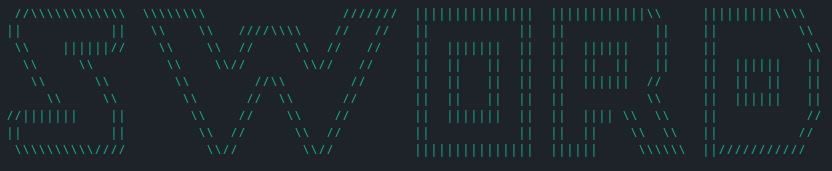

**Sword**
=========

### 
A aplicação que te ajuda a nunca chegar atrasado aos teus compromissos online!

A Sword surgiu de uma necessidade de um pequeno grupo de 4 alunos de engenharia informática da Universidade do Minho, que com a pandemia de COVID-19 e motivados pelo desafio da SEI'21, se deparou com a oportunidade de construir uma ferramenta que auxiliasse na participação de aulas online, trabalhos em grupo, palestras(,etc...) evitando assim a constante consulta dos horários, à procura de links, ou até a inconveniência do constante de multitasking entre aplicações e plataformas usadas para aulas, trabalhos e afins.

Assim sendo, a Sword foi criada abrangendo não só as necessidades de estes 4 alunos, mas também com vista na possibilidade de ser utilizada em outros contextos por utilizadores de todas as áreas, quer de estudo ou trabalho.

### O programa

Este programa foi feito com recurso à linguagem C e é exclusivamente operado pela consola. Para a sua criação foram tidos em conta os seguintes aspetos:
* Facilidade de agendar eventos que acontecem semanalmente;
* Possibilidade de alterar as componentes de um evento a qualquer hora;
* Abertura automática dos eventos na hora determinada pelo usuário;
* Aumentar a produtividade do usuário da aplicação.

Tendo em conta os pontos acima e o empenho dos seus criadores, chegamos a um resultado satisfatório onde disponibilizamos agora esta ferramenta para que possa ser utilizada por todos para melhorar a sua produtividade no deu dia-dia.

### Realizado por:  
- João Faria        <joaofaria.dias04@gmail.com>
- Ricardo Oliveira  <ricaoimp@gmail.com>
- Ricardo Sousa     <ricardo16464@agv.edu.pt>
- Rodrigo Freitas   <rodrigo-jose-@hotmail.com>

# SEI'21
# Hackathon

