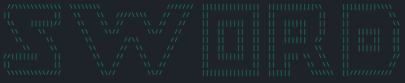

**Sword**
=========

### 
A aplicação que te ajuda a numca chegar atrasdo aos teus compromissos online!

A Sword surgiu de uma necessidade de um pequeno grupo de 4 alunos de engenharia informática da Universidade do Minho, que com a pandemia de COVID-19 se viu com a necessdidade da existeência de uma ferramenta que auxiliasse na participação de aulas online, evitando assim uma constantemente consulta do horário e das diversas plataformas usadas pelos professores para lecionar as aulas.

Assim sendo, a Sword foi criada abrangendo não só as necessidsades de estes 4 alunos, bem como foi desenvolvida a possibilidade de ser utilizada em outros contextos.

### O programa

Este programa foi feito com recurso à linguagem C e é exclusivante operado pela consola. Para a sua criação foram tidos em conta os seguintes aspetos:
* Facilidade de agendar eventos que acontecem semanalmente;
* Possibilidade de alterar as componentes de um evento a qualquer hora;
* Abertura automática dos eventos na hora determinada pelo usuário;
* Aumentar a produtividade do usuário da aplicação.

Tendo em conta os pontos acima e o empenho dos seus criadores, chegamos a um resultado satisfatório onde disponibilizamos agora esta ferramneta para que possa ser utilizada por todos para melhorar a sua produtividade no deu dia-dia.

### Realizado por:  
- João Faria  
- Ricardo Oliveira  
- Ricardo Sousa  
- Rodrigo Freitas  

# SEI'21
# Hackathon
